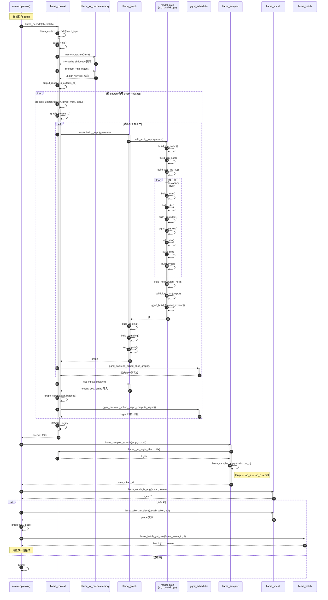

# llama-nano

一个基于 [llama.cpp](https://github.com/ggerganov/llama.cpp) 的极简本地大模型推理示例项目。目标是用最少的代码展示如何加载 GGUF 模型、进行 tokenize、执行解码循环并采样生成文本。

> 本项目为学习/演示用途，默认 CPU 推理、固定 Qwen3 对话模板，适合作为理解 llama.cpp C API 的入口。

---

## 特性

- 🚀 **极简入口**：核心逻辑集中在 `main.cpp`，约 130 行即可跑通推理。
- 🔧 **CPU 优先**：默认关闭所有 GPU backend，使用 Clang + OpenMP 优化 CPU 推理。
- 📦 **GGUF 格式**：直接加载量化后的 `.gguf` 模型文件。
- 🧠 **采样链路**：temperature → top-k → top-p → dist 的标准采样链。
- 📊 **量化工具**：附带 `llama-quantize` 可执行文件，用于模型量化。

---

## 项目结构

```
llama.cpp-nano/inference/
├── main.cpp              # 推理入口（加载模型 → tokenize → 解码循环 → 输出）
├── quantize.cpp          # 量化工具入口
├── CMakeLists.txt        # 构建配置，默认 Clang + CPU only
├── include/
│   └── llama.h           # llama.cpp C API 头文件
├── src/                  # llama 核心库源码
│   ├── llama.cpp
│   ├── llama-context.cpp
│   ├── llama-model.cpp
│   ├── llama-sampler.cpp
│   ├── llama-vocab.cpp
│   └── models/           # 各模型架构实现（如 qwen3.cpp）
├── ggml/                 # ggml 计算库子模块
├── cmake/                # CMake 模块
└── build/                # 构建输出目录
```

---

## 构建

### 依赖

- CMake >= 3.14
- Clang / Clang++（CMakeLists 中已默认指定）
- OpenMP（可选，默认开启）

### 编译步骤

```bash
cd /home/niwang/code/llama.cpp-nano/inference
mkdir -p build
cd build
cmake ..
cmake --build . -j$(nproc)
```

编译完成后会在 `build/bin/` 下生成：

- `llama-nano`：推理可执行文件
- `llama-quantize`：量化工具

---

## 使用

### 1. 准备模型

需要准备一个 GGUF 格式的模型文件，例如 Qwen3 量化版：

```bash
# 示例路径（需要自行下载或转换）
/home/niwang/code/llama.cpp-nano/models/model-Q4_K_M.gguf
```

### 2. 修改模型路径

当前 `main.cpp` 中模型路径为硬编码：

```cpp
std::string model_path = "/home/niwang/code/llama.cpp-nano/models/model-Q4_K_M.gguf";
```

请根据实际模型位置修改后重新编译，或者后续可改为命令行参数传入。

### 3. 运行推理

```bash
./build/bin/llama-nano
```

程序会：

1. 加载 `model-Q4_K_M.gguf`
2. 使用内置 Qwen3 对话模板拼接 prompt
3. 对 prompt 分词
4. 循环解码并采样生成 token
5. 输出文本并打印性能统计

---

## 核心调用流程

从 `main.cpp` 出发，主要调用时序如下：

```mermaid
sequenceDiagram
    autonumber

    participant M as main.cpp/main()
    participant BE as ggml_backend<br/>(ggml-backend-reg.cpp)
    participant LM as llama_model<br/>(llama.cpp / llama-model.cpp)
    participant LO as llama_model_loader<br/>(llama-model-loader.cpp)
    participant VOC as llama_vocab<br/>(llama-vocab.cpp)
    participant CTX as llama_context<br/>(llama-context.cpp)
    participant MEM as llama_kv_cache/memory
    participant GRF as llama_graph<br/>(llama-graph.cpp)
    participant ARC as model_arch<br/>(e.g. qwen3.cpp)
    participant SCH as ggml_scheduler
    participant BAT as llama_batch
    participant SM as llama_sampler<br/>(llama-sampler.cpp)

    rect rgb(230,245,255)
        Note over M: 1. 入口与初始化
        M->>M: apply_chat_template(user_msg)
        M->>BE: ggml_backend_load_all()
        activate BE
        BE-->>M: 后端注册完成
        deactivate BE
        M->>LM: llama_model_default_params()
        LM-->>M: model_params
        Note right of M: n_gpu_layers = 0 (CPU only)
    end

    rect rgb(230,255,230)
        Note over M: 2. 模型加载
        M->>LM: llama_model_load_from_file(path, params)
        activate LM
        LM->>LM: llama_model_load_from_file_impl()
        LM->>LO: new llama_model_loader()
        activate LO
        LO->>LO: gguf_init_from_file()
        LO-->>LM: loader ml
        deactivate LO
        LM->>LM: llama_model_create(ml, params)
        Note right of LM: llama_model_mapping(arch)<br/>如 new llama_model_qwen3()
        LM->>LM: llama_prepare_model_devices(params, model)
        LM->>LM: load_hparams(ml)
        LM->>LM: load_vocab(ml)
        LM->>VOC: llama_vocab::load(ml, kv)
        activate VOC
        VOC-->>LM: tokenizer 就绪
        deactivate VOC
        LM->>LM: load_stats(ml)
        LM->>LM: print_info()
        LM->>LM: load_tensors(ml)
        Note right of LM: create_tensor / mmap / malloc<br/>按 n_gpu_layers 分配 CPU/GPU
        LM-->>M: model 指针
        deactivate LM
    end

    rect rgb(255,255,230)
        Note over M: 3. 分词
        M->>LM: llama_model_get_vocab(model)
        LM-->>M: vocab
        M->>VOC: llama_tokenize(vocab, prompt, ..., true)
        activate VOC
        VOC-->>M: prompt_tokens[]
        deactivate VOC
    end

    rect rgb(255,230,245)
        Note over M: 4. 创建上下文
        M->>CTX: llama_context_default_params()
        CTX-->>M: ctx_params
        M->>CTX: llama_init_from_model(model, ctx_params)
        activate CTX
        CTX->>CTX: 参数校验
        CTX->>CTX: new llama_context(model, params)
        activate CTX
        CTX->>CTX: 填充 cparams
        CTX->>BE: ggml_backend_dev_init / init_by_type
        BE-->>CTX: backend 列表
        CTX->>CTX: output_reserve()
        CTX->>MEM: llama_model::create_memory()
        activate MEM
        MEM-->>CTX: KV cache / memory 对象
        deactivate MEM
        CTX->>CTX: sched_reserve()
        deactivate CTX
        CTX-->>M: ctx 指针
        deactivate CTX
    end

    rect rgb(255,240,220)
        Note over M: 5. 采样器初始化
        M->>SM: llama_sampler_chain_default_params()
        M->>SM: llama_sampler_chain_init(params)
        activate SM
        SM-->>M: sampler chain
        deactivate SM
        alt temperature > 0
            M->>SM: llama_sampler_chain_add(temp)
            M->>SM: llama_sampler_chain_add(top_k)
            M->>SM: llama_sampler_chain_add(top_p)
            M->>SM: llama_sampler_chain_add(dist)
        else temperature <= 0
            M->>SM: llama_sampler_chain_add(greedy)
        end
    end

    rect rgb(230,230,255)
        Note over M: 6. 准备 Batch
        M->>BAT: llama_batch_get_one(prompt_tokens, n_tokens)
        BAT-->>M: batch
    end

    rect rgb(220,255,255)
        Note over M: 7. 主推理循环 (n_pos++)
        loop 直到生成 EOS / 达到最大长度
            M->>CTX: llama_decode(ctx, batch)
            activate CTX
            CTX->>CTX: llama_context::decode(batch)
            activate CTX
            CTX->>CTX: balloc->init()
            CTX->>MEM: memory_update(false)
            CTX->>MEM: memory->init_batch()
            CTX->>CTX: output_reserve()

            loop 按 ubatch 循环 (mctx->next())
                CTX->>CTX: process_ubatch(ubatch, ...)
                activate CTX
                CTX->>CTX: graph_params(...)
                alt 计算图不可复用
                    CTX->>GRF: model.build_graph(gparams)
                    activate GRF
                    GRF->>ARC: build_arch_graph(params)
                    activate ARC
                    Note right of ARC: 以 Qwen3 为例<br/>build_inp_embd / build_inp_pos<br/>for each layer:<br/>norm / qkv / rope / attn / ffn
                    ARC-->>GRF: gf
                    deactivate ARC
                    GRF->>GRF: build_pooling / build_sampling
                    GRF->>GRF: set_outputs()
                    GRF-->>CTX: graph
                    deactivate GRF
                    CTX->>SCH: ggml_backend_sched_alloc_graph()
                end
                CTX->>GRF: set_inputs(&ubatch)
                CTX->>CTX: graph_compute(gf, batched)
                CTX->>SCH: ggml_backend_sched_graph_compute_async()
                SCH-->>CTX: logits / 输出张量
                deactivate CTX
            end

            CTX->>CTX: 提取输出 logits
            deactivate CTX
            CTX-->>M: decode 完成
            deactivate CTX

            M->>SM: llama_sampler_sample(smpl, ctx, -1)
            activate SM
            SM->>CTX: llama_get_logits_ith(ctx, idx)
            CTX-->>SM: logits
            SM->>SM: llama_sampler_apply(chain, cur_p)
            Note right of SM: temp → top_k → top_p → dist
            SM-->>M: new_token_id
            deactivate SM

            M->>VOC: llama_vocab_is_eog(vocab, token)
            VOC-->>M: is_end

            M->>VOC: llama_token_to_piece(vocab, token, buf)
            VOC-->>M: piece 文本

            M->>M: printf("%s", piece)

            M->>BAT: llama_batch_get_one(&new_token_id, 1)
            BAT-->>M: batch (下一 token)
        end
    end

    rect rgb(240,240,240)
        Note over M: 8. 收尾与清理
        M->>SM: llama_perf_sampler_print(smpl)
        M->>CTX: llama_perf_context_print(ctx)
        M->>SM: llama_sampler_free(smpl)
        activate SM
        SM-->>M: 释放
        deactivate SM
        M->>CTX: llama_free(ctx)
        activate CTX
        CTX->>CTX: ~llama_context()
        deactivate CTX
        M->>LM: llama_model_free(model)
        activate LM
        LM->>LM: ~llama_model()
        deactivate LM
    end
```



### 时序图说明

| 颜色区域 | 阶段 |
|---|---|
| 🔵 浅蓝 | 入口与初始化 |
| 🟢 浅绿 | 模型加载 |
| 🟡 浅黄 | 分词 |
| 🩷 浅粉 | 创建上下文 |
| 🟠 浅橙 | 采样器初始化 |
| 🟣 浅紫 | Batch 准备 |
| 🩵 浅青 | 主推理循环 |
| ⚪ 灰 | 清理收尾 |

主循环中：`llama_decode()` 负责前向传播，内部可能触发 `model.build_graph()` 构建计算图（如 Qwen3 会调用 `qwen3.cpp` 中的架构相关实现），最终通过 `ggml_backend_sched_graph_compute_async()` 执行。输出 logits 经 `llama_sampler_sample()` 采样后得到下一个 token，再反转为文本输出。

---

## 主推理循环详图

下面把主推理循环单独放大，展示一次 decode → 采样 → 输出 → 准备下一 batch 的完整时序。



### 关键步骤说明

1. **`llama_decode()`**：主入口，把当前 batch 送入上下文。
2. **`memory_update()` / `memory->init_batch()`**：管理 KV cache，包括缓存移位、拷贝、为当前 ubatch 分配 slot。
3. **`process_ubatch()`**：真正的单个子 batch 处理单元。如果图参数发生变化，会触发重新建图。
4. **`model.build_graph()` / `build_arch_graph()`**：按模型架构（如 Qwen3）逐层构建 Transformer 计算图。
5. **`ggml_backend_sched_graph_compute_async()`**：调度器在 backend（此处为 CPU）上异步执行计算图。
6. **`llama_sampler_sample()`**：从 logits 中按采样链选出下一个 token。
7. **`llama_token_to_piece()`**：把 token id 解码为可见文本片段并输出。
8. **`llama_batch_get_one()`**：把新 token 打包成下一轮的输入 batch。

---

## 配置选项

在 `CMakeLists.txt` 中可通过以下选项调整构建：

| 选项 | 默认值 | 说明 |
|---|---|---|
| `LLAMA_NATIVE` | `ON` | 针对当前 CPU 指令集优化 |
| `LLAMA_OPENMP` | `ON` | 使用 OpenMP 多线程 |
| `LLAMA_BUILD_MAIN` | `ON` | 构建推理可执行文件 |

例如关闭 OpenMP：

```bash
cmake .. -DLLAMA_OPENMP=OFF
```

---

## 注意事项

1. **硬编码路径**：当前 `main.cpp` 中模型路径、默认 prompt、对话模板均为硬编码，生产使用建议改为命令行参数。
2. **CPU only**：CMakeLists 显式关闭了 CUDA、Metal、Vulkan 等所有 GPU backend。
3. **Qwen3 模板**：`apply_chat_template()` 当前只适配 Qwen3 风格对话模板，使用其他模型需修改。
4. **C++17**：项目使用 C++17 标准。

---

## 许可证

本项目基于 llama.cpp，遵循其开源许可证。具体请查看 `ggml/` 及源码文件中的许可声明。

---

## 后续可扩展

- [ ] 支持命令行参数（`--model`、`--prompt`、`--n_predict`、`--temperature` 等）
- [ ] 支持多轮对话
- [ ] 支持对话模板根据模型自动选择
- [ ] 支持流式输出 / server 模式
- [ ] 支持 GPU backend 可选开启
